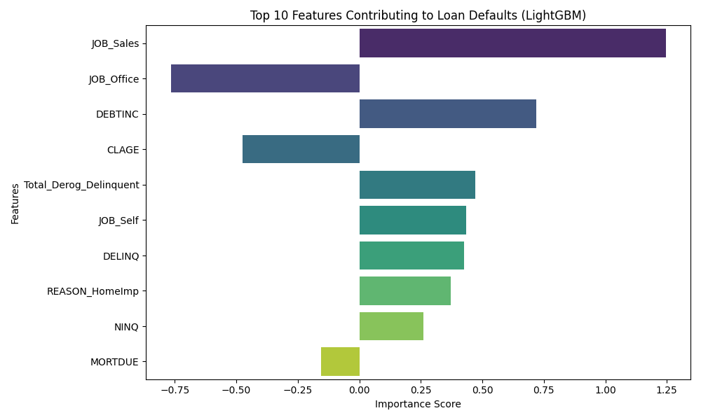
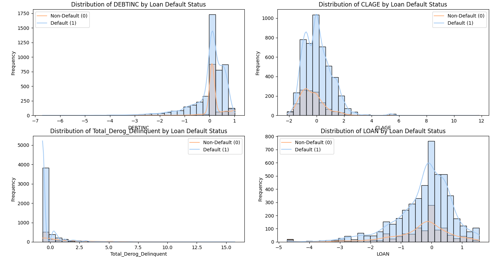
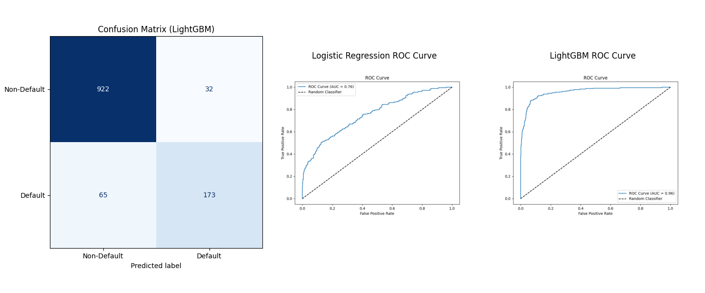

# Loan Default Prediction Project

## Overview
This project focuses on predicting loan defaults using machine learning techniques. The dataset used is the Home Equity dataset (HMEQ), which contains information about loan performance and borrower characteristics. The goal is to explore borrower patterns, clean and preprocess the data, engineer meaningful features, and train models to classify whether a borrower is likely to default on their loan.

## Dataset
- **Source**: Home Equity dataset (HMEQ)
- **Size**: 5,960 records
- **Target Variable**: `BAD` (binary: 0 = Non-default, 1 = Default)
- **Features**:
  - Loan amount, mortgage due, value of property, debt-to-income ratio, employment details, and more.

## Workflow
1. **Data Cleaning**:
   - Handled missing values.
   - Encoded categorical variables.
   - Scaled and normalized numerical variables.

2. **Feature Engineering**:
   - Created interaction terms (e.g., Debt-to-Value ratio).
   - Aggregated features (e.g., Total derogatory + delinquent records).
   - Applied transformations (e.g., log transformation).

3. **EDA (Exploratory Data Analysis)**:
   - Explored distributions of key features.
   - Analyzed relationships between features and default status.

4. **Model Training**:
   - Baseline: Logistic Regression (AUC = 0.76)
   - Advanced: LightGBM (AUC = 0.96)
   - Evaluated using metrics like accuracy, F1-score, and confusion matrix.

5. **Insights and Visualization**:
   - Identified top features contributing to defaults.
   - Visualized model performance with confusion matrices and ROC curves.

## Key Results
- **Baseline Logistic Regression**:
  - **Accuracy**: 74%
  - **ROC-AUC**: 0.76

- **LightGBM Model**:
  - **Accuracy**: 92%
  - **ROC-AUC**: 0.96
  - LightGBM significantly outperformed Logistic Regression, especially in recall for default predictions.

## Visualizations
### Feature Importance (LightGBM)


### Borrower Characteristics


### Model Performance


## How to Run
### Prerequisites
Ensure you have Python installed along with the required libraries. Install dependencies using:
```bash
pip install -r requirements.txt

Steps to Execute
Run the scripts in order:

data_cleaning.py
feature_engineering.py
eda.py
model_training.py
model_training_lgbm.py
insights_visualization.py
View Results:

Outputs (e.g., cleaned datasets, feature importance, visualizations) are saved in the data/ folder.
Future Improvements
Incorporate additional external data for richer feature engineering.
Explore hyperparameter tuning for LightGBM to further improve performance.
Deploy the model using a framework like Flask or FastAPI.
License
This project is licensed under the MIT License.

Contact
For questions or collaboration, feel free to reach out!